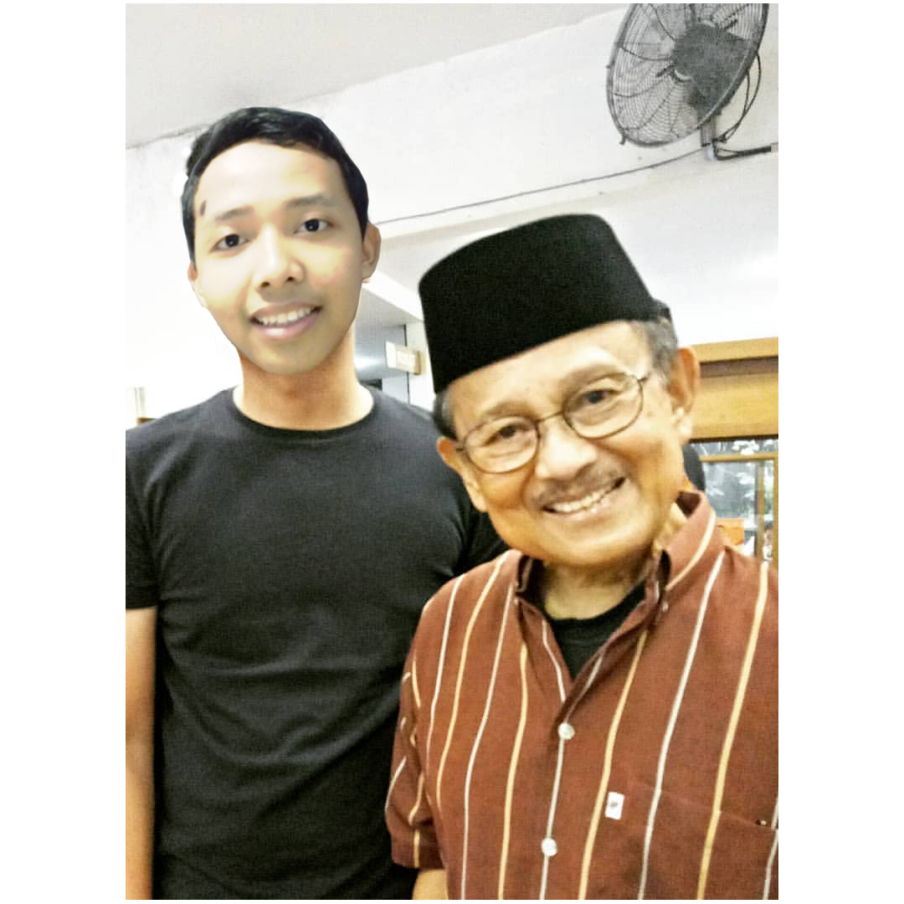

# arrafi01.github.io
<!DOCTYPE html>
<html>
<head>
	<title>Muhammad Arrafi</title>
	<link rel="stylesheet" type="text/css" href="style.css">
</head>
<body>
	<h2>
Biodata
</h2>
	
<em>Nama : Muhammad Arrafi</em>

	
<em>TTL  : Jumat, 19 oktober 2002</em>

	
<em>Status : Pelajar</em>

	
<em>Sekolah : SMK - SMAK Bogor</em>

	
<em>Agama : Islam</em>

	
<em>Jenis Kelamin : Laki - laki</em>

	
<em>Moto Hidup</b> : <q>jika engkau tidak mampu bersaing dengan orang shaleh dalam ibadahnya maka bersainglah dengan para pendosa dalam tobatnya</q></em>

		
	
	<h2>Deskripsi</h2>
	
<strong>Hi!..</strong>namaku Muhammad arrafi,Aku biasa di panggil rafi oleh teman sd saat smp saya sering dipanggil arrafi maupun rafi dan sekarang sayasering dipanggil arap.saya lahir pada tanggal 19 oktober 2019 di Jakarta. saya tinggal di kota Depok yang penuh berjuta cerita karena saya tinggal di depok sejak lahir.saya merupakan almuni dari sekolah  SD Sukamaju Baru  3 lalu melanjutkan sekolah di SMP 7 Depok.sekarang saya sekolah di SMK-SMAK Bogor.cita cita saya ialah menjadi analis yang membanggakan smakbo dan terutama membahagiakan orang tua akhirat maupun dunia. 

	<a href="HTML2.html">keluarga dan pendidikanku</a>

	<h2>
<em>Berikut Adalah Foto - Foto saya</em>
</h2>
	

	
dalam foto itu terdapat saya dan idola saya. beliau bernama Bj.habibie yang menjadi presiden ke 3 indonesia. saya sangat kagum dengan hal itu, lagi lagi beliaulah yang membuat pesawat di indonesia pertama kali. yang membuat kukagum ialah perjuangan beliau semasa hidupnya. saat kecil ia sangat suka membaca, beliau sangat sulit diajak main keluar. suatu ketika dia disuruh main keluar,lalu ia main, tetapi saat tidak ada yang melihat ia, ia masuk ke dalam rumah lagi dan membaca buku lagi. ini lah yang membuat saya kagum. atas kerja keras itulah beliau bisa mencapai saat ini. dari beliaulah saya mengetahui hasil tidak akan mengecewakan usaha. 

	
	
saya sangat suka bermain buku tangkis.saya suka karena bulu tangkis dapat menggerakan badan saya. badan saya digerakan bulu tangkis. gerakan badan saya oleh bulu tangkis. jadi gitu. selain itu saya suka permain ini karena jika perasaan saya sedang tidak mengenakan saya bisa memukul sekuat kuatnya jika saya sedang relaks saya bisa bermain dengan santai dan permain ini mudah dilakukan pada tempat yang kecil. 

	

	
ini hasil karya saya yang menceritakan korek korek yang mempunyai kekuatan menyatukan diri dalam format gif yang saya beri nama TEANSFORMER RIBUT. 

